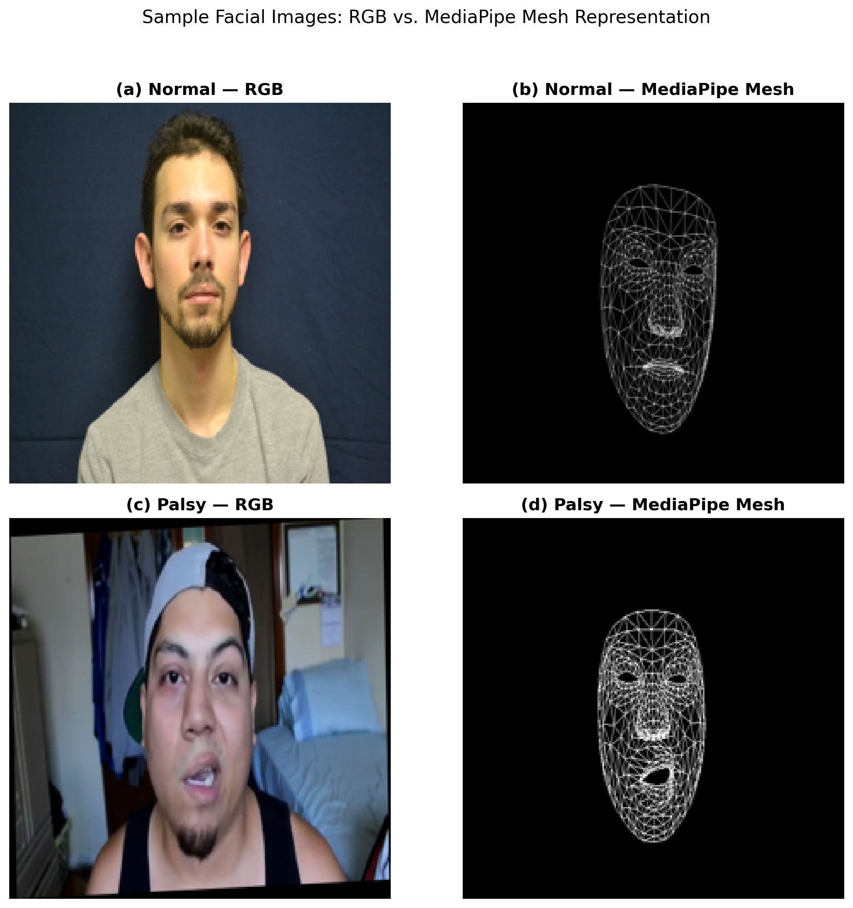
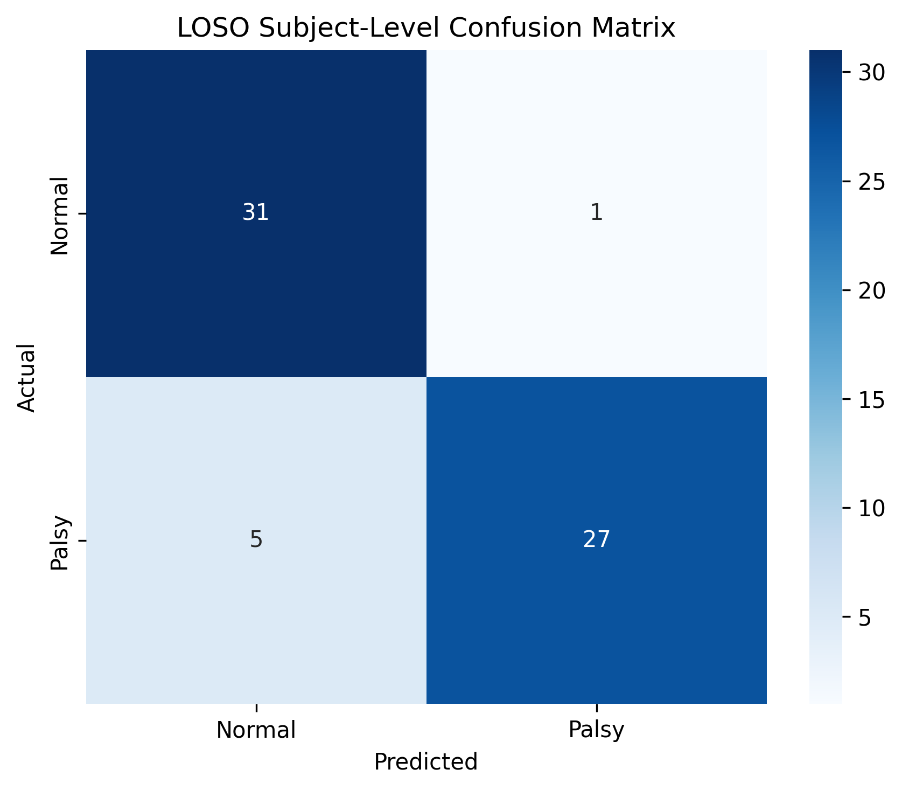
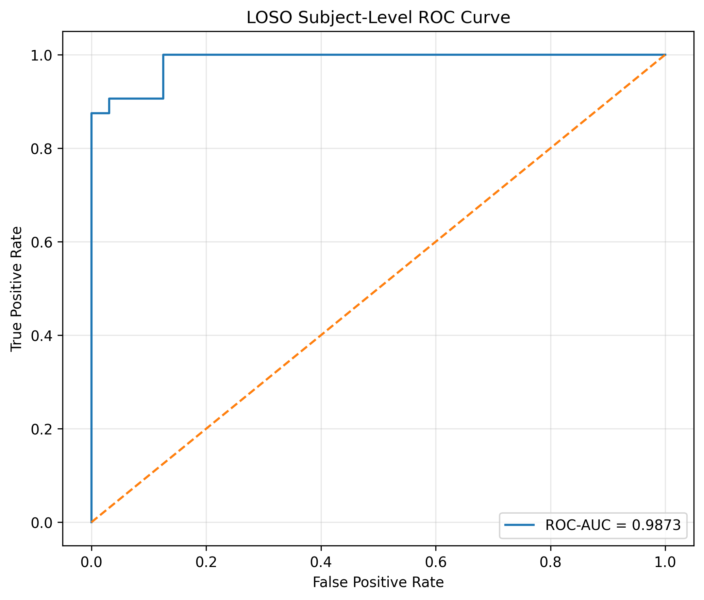

# Facial Paralysis Screening via Subject-Independent Deep Learning on MediaPipe Facial Mesh Representations

A research-grade binary classification system for facial paralysis screening using convolutional neural networks (CNNs) with subject-independent evaluation. This repository implements a Leave-One-Subject-Out (LOSO) protocol using MediaPipe facial mesh representations to assess generalization to unseen subjects.

---

## Overview

Facial paralysis, commonly caused by conditions such as Bell's palsy, requires accurate clinical assessment for effective treatment planning. This project investigates whether structural facial geometry, captured via MediaPipe facial mesh landmarks, provides discriminative features for automated normal versus palsy classification under a rigorous subject-independent evaluation protocol.

**Key contributions:**

- Subject-independent LOSO evaluation protocol across 64 subjects (64 folds), eliminating image-level data leakage.
- MediaPipe facial mesh representation that encodes facial geometry while discarding appearance-specific confounds.
- ResNet50-based classification pipeline with subject-level prediction aggregation and validation-derived threshold calibration.

---

## Sample Data

The figure below illustrates the two input representations used in this study. Each row shows a sample from one class; each column shows one representation.

<p align="center">
  
</p>

<p align="center">
  <em>Figure 1. Sample facial images showing the two input representations. (a) A normal-subject RGB photograph. (b) The corresponding MediaPipe facial mesh rendering (white wireframe on black background). (c) A palsy-subject RGB photograph. (d) The corresponding MediaPipe facial mesh rendering.</em>
</p>

> **Note:** The full dataset is not included in this repository. Only single representative samples are provided to illustrate the data format and directory structure.

---

## Datasets

Two publicly available facial image datasets were used:

| Class | Source Dataset | Subjects | Image Format |
|-------|---------------|----------|--------------|
| **Normal** | AFLFP (Australian Facial Landmark and Facial Action Parameter) Database | 32 (selected from 113) | JPEG |
| **Palsy** | YFP (Youtube Facial Palsy) Dataset | 32 (all available) | BMP |

The balanced experimental subset comprises **64 subjects** (32 normal, 32 palsy) with a maximum of **64 images per subject**, yielding the two primary data representations:

- **RGB**: Original facial photographs resized to 224 × 224.
- **Mesh**: MediaPipe Face Mesh (468 landmarks) rendered as a white wireframe on a pure black background, stored as PNG.

---

## Methodology

### Architecture

All experiments use **ResNet50** pretrained on ImageNet (`IMAGENET1K_V2`) with the final fully connected layer replaced for binary classification (Normal vs. Palsy).

| Parameter | Value |
|-----------|-------|
| Input resolution | 224 × 224 |
| Optimizer | AdamW |
| Learning rate | 1 × 10⁻⁴ |
| Weight decay | 1 × 10⁻⁴ |
| Scheduler | ReduceLROnPlateau (factor=0.5, patience=2) |
| Batch size per GPU | 32 |
| Maximum epochs | 50 |
| Early stopping patience | 7 |
| Mixed precision | CUDA AMP (float16) |
| Random seed | 456 |

### Training Augmentation

Geometric augmentationation is applied during training:

```
RandomHorizontalFlip(p=0.5)
RandomRotation(10°)
RandomAffine(translate=(0.05, 0.05), scale=(0.95, 1.05))
```

ImageNet normalization: mean = [0.485, 0.456, 0.406], std = [0.229, 0.224, 0.225].

### Subject-Level LOSO Evaluation Protocol

The primary evaluation uses a **Leave-One-Subject-Out** (LOSO) protocol:

1. **64 subjects → 64 folds.** Each fold holds out exactly one subject as the test set.
2. The remaining **63 subjects** are split into training (80%) and validation (20%) subsets at the subject level.
3. The model is trained on the training subjects, with early stopping based on validation loss.
4. The best epoch is selected using the validation set. A classification threshold is derived from validation subjects using the **Youden J statistic**.
5. The held-out test subject is evaluated using this threshold.
6. **Subject-level prediction**: the mean probability across all images of the subject is computed. The subject is classified as Palsy if this mean probability ≥ threshold; otherwise Normal.

This protocol ensures that no images from the test subject appear in training, validation, augmentation, or threshold selection, providing a rigorous measure of subject-independent generalization.

### Distributed Training

All LOSO experiments are distributed across **4 × NVIDIA Tesla V100 32GB GPUs**, with each GPU independently training its assigned folds (16 folds per GPU). Distributed Data Parallel (DDP) is not used across GPUs for a single fold, as LOSO folds are independent experiments.

---

## Results

### ResNet50 LOSO (Mesh Representation)

| Metric | Value |
|--------|-------|
| Accuracy | 90.62% |
| Precision | 96.43% |
| Sensitivity | 84.38% |
| Specificity | 96.88% |
| F1 Score | 90.00% |
| ROC-AUC | 0.9873 |

**Confusion Matrix (Subject-Level):**

| | Pred. Normal | Pred. Palsy |
|---|:---:|:---:|
| **Actual Normal** | 31 (TN) | 1 (FP) |
| **Actual Palsy** | 5 (FN) | 27 (TP) |

<p align="center">
  
  
</p>
<p align="center">
  <em>Figure 2. Mesh representation LOSO results. Left: Subject-level confusion matrix. Right: ROC curve (AUC = 0.9873).</em>
</p>

---

## Repository Structure

```
FP-codebase-repo/
│
├── README.md
├── requirements.txt
├── pyproject.toml
├── uv.lock
│
├── # --- Preprocessing Scripts ---
├── mesh_normal.py              # MediaPipe mesh generation for AFLFP (Normal) subjects
├── mesh_palsy.py               # MediaPipe mesh generation for YFP (Palsy) subjects
├── prepare_training_dataset.py # Balanced dataset construction (fixed-holdout)
├── arrange_rgb_dataset.py      # RGB dataset arrangement with LOSO fold assignments
├── add_aflfp_to_normal.py      # AFLFP subject integration utility
├── copy_normal.py              # Normal subject data curation
├── copy_palsy.py               # Palsy subject data curation
├── check_gpu.py                # GPU availability verification
│
├── # --- Training Scripts ---
├── loso_resnet50.py            # Mesh ResNet50 LOSO experiment (4-GPU)
├── train_resnet50.py           # Mesh ResNet50 fixed-holdout training (4-GPU DDP)
│
├── # --- Sample Data (skeletal, for structure illustration only) ---
├── AFLFP/                      # Raw AFLFP source (1 sample subject)
├── Normal Set/Subjects/        # Normal RGB source (1 sample subject)
├── Palsy Set/                  # Palsy RGB source (1 sample subject)
├── dataset/normal/             # Normal mesh images (1 sample subject)
├── Training/                   # Curated mesh dataset (sample class folders)
│
├── # --- Figures and Results ---
├── figures/
│   └── sample_comparison.png   # RGB vs. Mesh comparison figure
└── results/
    └── mesh_loso/              # Mesh LOSO confusion matrix, ROC curve, summary
```

---

## Environment Setup

### Prerequisites

- Python ≥ 3.12
- CUDA-capable GPU(s) with NVIDIA driver ≥ 535
- 4 × GPU recommended for full LOSO experiments (single GPU supported)

### Installation

```bash
# Clone the repository
git clone https://github.com/XyeusXMachina/FP-codebase-repo.git
cd FP-codebase-repo

# Create and activate a virtual environment
python -m venv .venv
source .venv/bin/activate

# Install PyTorch with CUDA support
pip install torch torchvision torchaudio --index-url https://download.pytorch.org/whl/cu121

# Install remaining dependencies
pip install -r requirements.txt
```

### Verify GPU Setup

```bash
python check_gpu.py
```

---

## Usage

### 1. Generate Facial Mesh Images

```bash
# Generate mesh for Normal (AFLFP) subjects
python mesh_normal.py

# Generate mesh for Palsy (YFP) subjects
python mesh_palsy.py
```

### 2. Prepare Training Dataset

```bash
# Create balanced dataset with subject-level splits
python prepare_training_dataset.py

# Arrange RGB dataset with LOSO fold assignments
python arrange_rgb_dataset.py
```

### 3. Run LOSO Experiment

```bash
# Mesh ResNet50 LOSO (4 GPUs)
torchrun --standalone --nproc_per_node=4 loso_resnet50.py
```

### 4. Monitor GPU Usage

```bash
watch -n 1 nvidia-smi
```

---

## Limitations

1. **Cross-dataset domain bias.** The Normal and Palsy classes originate from different datasets (AFLFP and YFP), which may introduce dataset-specific visual confounds (background, lighting, camera, resolution, compression).
2. **Limited subject pool.** The balanced experiment uses 64 subjects; generalization to broader populations requires further validation.
3. **Sample imbalance within subjects.** Some subjects contain fewer than 64 usable images, leading to variable per-subject sample sizes.
4. **Threshold methodology.** Per-fold Youden J thresholds are used; a fixed global threshold may be more appropriate for deployment.
5. **Single architecture.** Only ResNet50 is evaluated; other architectures (EfficientNet, DenseNet, ConvNeXt) may yield different results.

---

## Citation

If you use this code or findings in your research, please cite:

```bibtex
@misc{facial_paralysis_classification_2025,
  title   = {Facial Paralysis Screening via Subject-Independent Deep Learning on MediaPipe Facial Mesh Representations},
  author  = {[Author Names]},
  year    = {2025},
  note    = {Master's thesis, [Institution]}
}
```

---

## License

This project is released for academic and research purposes.

---

## Acknowledgements

- **AFLFP** — Australian Facial Landmark and Facial Action Parameter Database
- **YFP** — Yorkshire Facial Paralysis Dataset
- MediaPipe Face Mesh — Google MediaPipe team
- PyTorch and Torchvision — Meta AI
