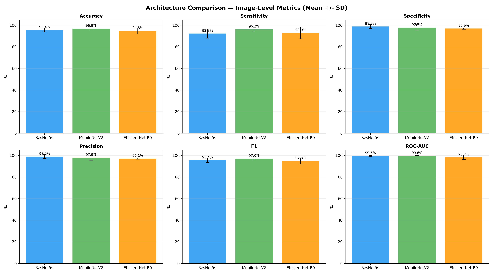
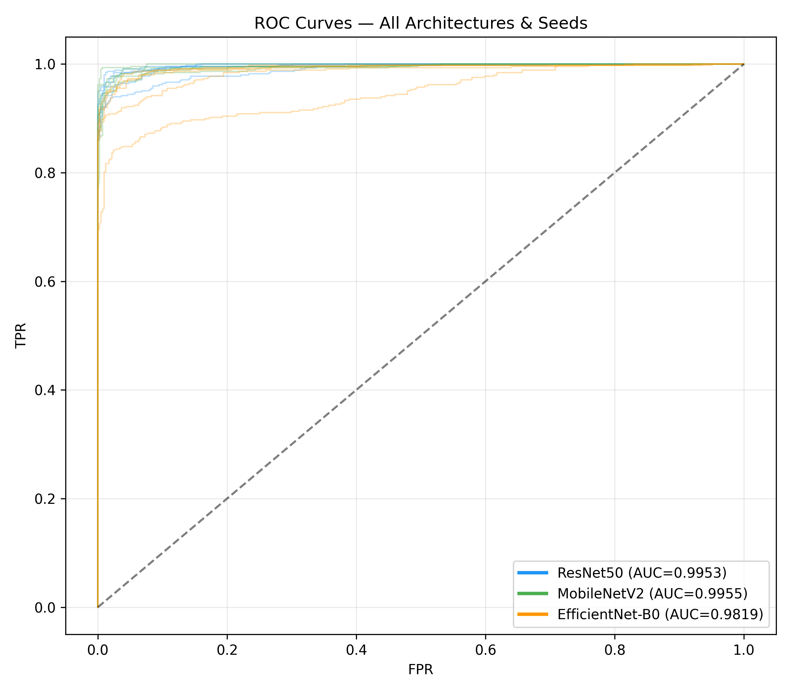
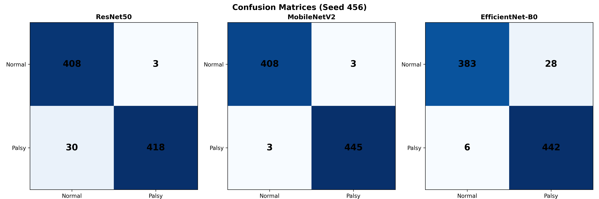
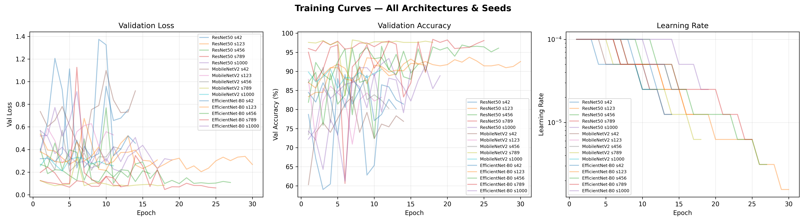

# Comparative Analysis of CNN Architectures for Facial Paralysis Screening

A controlled comparative study of three CNN architectures—**ResNet50**, **MobileNetV2**, and **EfficientNet-B0**—for binary facial paralysis classification using MediaPipe Face Mesh images. All architectures were evaluated under identical experimental conditions to determine which offers the best trade-off between accuracy, model complexity, and training efficiency.

---

## Overview

The parent study established that MediaPipe facial mesh representations combined with a ResNet50 classifier achieve 90.62% subject-level accuracy under Leave-One-Subject-Out (LOSO) evaluation. This follow-up experiment addresses a key limitation of that work: **whether the results are architecture-specific or generalise across modern CNN designs**.

Three architectures spanning different design philosophies were compared:

| Architecture | Parameters | Design Philosophy |
|---|---|---|
| **ResNet50** | 23.5M | Deep residual network |
| **MobileNetV2** | 2.2M | Lightweight depthwise-separable convolutions |
| **EfficientNet-B0** | 4.0M | Compound-scaled efficiency |

---

## Experimental Design

### Controlled Variables

All factors were held constant across architectures to ensure a fair comparison:

| Component | Configuration |
|---|---|
| Dataset | 64 subjects (32 Normal, 32 Palsy); 3,926 mesh images |
| Train/Test Split | Fixed holdout: 50 train subjects, 14 test subjects |
| Validation | Subject-level 20% split from training cohort |
| Input | 224 × 224 RGB mesh images (white wireframe on black) |
| Pretraining | ImageNet |
| Optimizer | AdamW (lr = 1×10⁻⁴, weight decay = 1×10⁻⁴) |
| Scheduler | ReduceLROnPlateau (factor = 0.5, patience = 2) |
| Batch size | 32 per GPU |
| Max epochs | 50 |
| Early stopping | Patience 7 (on validation loss) |
| Mixed precision | CUDA AMP (float16) |
| Augmentation | Horizontal flip, rotation (10°), affine (translate 5%, scale 5%) |
| Threshold | Youden J statistic from validation subject probabilities |
| Seeds | 42, 123, 456, 789, 1000 (5 per architecture) |
| Total runs | **15** (3 architectures × 5 seeds) |
| Hardware | 4 × NVIDIA Tesla V100-PCIE-32GB (one run per GPU in parallel) |

---

## Results

### Image-Level Performance (Mean ± SD across 5 seeds)

| Architecture | Accuracy | Sensitivity | Specificity | F1 | ROC-AUC |
|---|---|---|---|---|---|
| **ResNet50** | 95.41% ± 1.83% | 92.28% ± 4.32% | 98.83% ± 1.94% | 95.41% ± 1.95% | 0.9953 ± 0.0041 |
| **MobileNetV2** | **96.90% ± 1.37%** | **96.16% ± 2.36%** | 97.71% ± 2.85% | **97.01% ± 1.30%** | **0.9955 ± 0.0025** |
| **EfficientNet-B0** | 94.81% ± 2.86% | 92.86% ± 5.40% | **96.93% ± 0.72%** | 94.85% ± 3.00% | 0.9819 ± 0.0206 |

### Subject-Level Performance (Mean ± SD across 5 seeds)

| Architecture | Accuracy | Sensitivity | Specificity | F1 | ROC-AUC |
|---|---|---|---|---|---|
| **ResNet50** | 97.14% ± 3.91% | 94.29% ± 7.82% | 100.00% ± 0.00% | 96.92% ± 4.21% | **1.0000 ± 0.0000** |
| **MobileNetV2** | **97.14% ± 3.91%** | **94.29% ± 7.82%** | 100.00% ± 0.00% | **96.92% ± 4.21%** | **1.0000 ± 0.0000** |
| **EfficientNet-B0** | 95.71% ± 3.91% | 91.43% ± 7.82% | 100.00% ± 0.00% | 95.38% ± 4.21% | 0.9959 ± 0.0091 |

### Per-Seed Detail: Image Level

<strong>ResNet50</strong>

| Seed | Accuracy | Sensitivity | Specificity | F1 | ROC-AUC | Best Epoch |
|---|---|---|---|---|---|---|
| 42 | 92.90% | 86.38% | 100.00% | 92.69% | 0.9883 | 6 |
| 123 | 96.39% | 93.53% | 99.51% | 96.43% | 0.9971 | 10 |
| 456 | 94.30% | 89.29% | 99.76% | 94.23% | 0.9972 | 9 |
| 789 | 97.56% | 95.76% | 99.51% | 97.61% | 0.9985 | 5 |
| 1000 | 95.93% | 96.43% | 95.38% | 96.11% | 0.9951 | 12 |

<strong>MobileNetV2</strong>

| Seed | Accuracy | Sensitivity | Specificity | F1 | ROC-AUC | Best Epoch |
|---|---|---|---|---|---|---|
| 42 | 96.51% | 93.75% | 99.51% | 96.55% | 0.9929 | 7 |
| 123 | 96.51% | 93.53% | 99.76% | 96.54% | 0.9959 | 4 |
| 456 | **99.07%** | 98.66% | 99.51% | **99.10%** | **0.9994** | 5 |
| 789 | 97.09% | 97.54% | 96.59% | 97.22% | 0.9951 | 11 |
| 1000 | 95.34% | 97.32% | 93.19% | 95.61% | 0.9941 | 4 |

<strong>EfficientNet-B0</strong>

| Seed | Accuracy | Sensitivity | Specificity | F1 | ROC-AUC | Best Epoch |
|---|---|---|---|---|---|---|
| 42 | 93.83% | 90.85% | 97.08% | 93.89% | 0.9841 | 7 |
| 123 | 96.16% | 95.54% | 96.84% | 96.29% | 0.9923 | 23 |
| 456 | 97.09% | 97.99% | 96.11% | 97.23% | 0.9941 | 20 |
| 789 | 96.74% | 95.54% | 98.05% | 96.83% | 0.9932 | 18 |
| 1000 | 90.22% | 84.38% | 96.59% | 90.00% | 0.9458 | 8 |

---

## Comparative Figures

### Architecture Comparison

  

  <em>Figure 1. Cross-architecture comparison of image-level accuracy, sensitivity, specificity, F1, and ROC-AUC across five seeds. MobileNetV2 leads in accuracy and F1; all architectures achieve comparable AUC.</em>

### ROC Curves

  

  <em>Figure 2. ROC curves for all 15 runs overlaid by architecture. ResNet50 and MobileNetV2 show tighter clustering (lower variance), while EfficientNet-B0 exhibits greater spread.</em>

### Confusion Matrices

  

  <em>Figure 3. Image-level confusion matrices comparing the three architectures (best seed per architecture).</em>

### Training Curves

  

  <em>Figure 4. Training and validation loss curves across architectures, showing convergence behaviour and early stopping points.</em>

---

## Discussion

### Key Findings

1. **MobileNetV2 is the best overall architecture for this task.** Despite having only ~2.2M parameters (roughly 10× fewer than ResNet50), it achieved the highest mean image-level accuracy (96.90%) with the lowest variability (SD 1.37%). This demonstrates that model complexity is not necessary for mesh-based facial paralysis classification.

2. **ResNet50 and MobileNetV2 are equivalent at the subject level.** Both achieved 97.14% mean subject-level accuracy and perfect 1.0000 ROC-AUC across all five seeds. The deeper architecture provides no advantage over the lightweight alternative.

3. **EfficientNet-B0 is more variable.** While its mean performance is competitive (94.81% image-level accuracy), it showed higher cross-seed variability (SD 2.86%) and its worst seed (1000) dropped to 90.22%. This suggests greater sensitivity to weight initialisation.

4. **Training efficiency favours MobileNetV2.** Mean training time was ~4.0 min per run for MobileNetV2, compared to ~4.9 min for ResNet50 and ~6.0 min for EfficientNet-B0.

### Comparison to Prior LOSO Results

| Evaluation | Architecture | Accuracy | ROC-AUC |
|---|---|---|---|
| LOSO (primary) | ResNet50 | 90.62% | 0.9873 |
| Fixed-holdout (this study) | ResNet50 | 95.41% ± 1.83% | 0.9953 ± 0.0041 |
| Fixed-holdout (this study) | MobileNetV2 | 96.90% ± 1.37% | 0.9955 ± 0.0025 |

The fixed-holdout results are higher than LOSO because they evaluate on the same 14 subjects across all runs. LOSO evaluates all 64 subjects with each appearing once as unseen, providing a more conservative and generalisable estimate. The LOSO result remains the primary benchmark.

---

## Conclusion

MobileNetV2 achieves the best combination of accuracy, stability, and efficiency for mesh-based facial paralysis screening. With 10× fewer parameters than ResNet50 and comparable or superior performance, it offers a practical path toward deployment in resource-constrained clinical settings. Future work should replicate these findings under per-architecture LOSO evaluation and validate on an independent external cohort.

---

## Reproducibility

The comparative analysis was executed by `run_comparative_study.py` using three architectures (ResNet50, MobileNetV2, EfficientNet-B0), five seeds (42, 123, 456, 789, 1000), 224 × 224 inputs, batch size 32, AdamW (learning rate and weight decay 1×10⁻⁴), a 20% subject-level validation split, up to 50 epochs with early stopping patience 7, CUDA AMP mixed-precision training, and Youden J threshold selection from validation subject probabilities. Four NVIDIA Tesla V100-PCIE-32GB GPUs were used, with one independent run per GPU.
